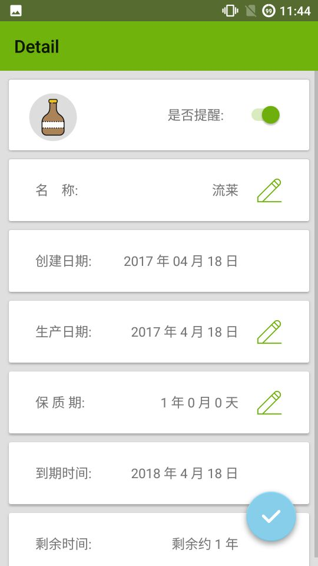
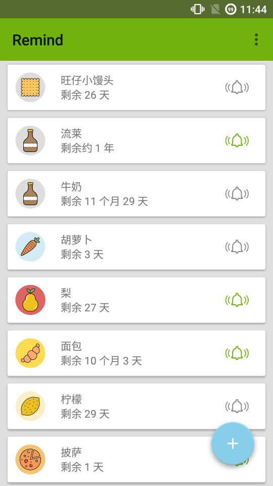
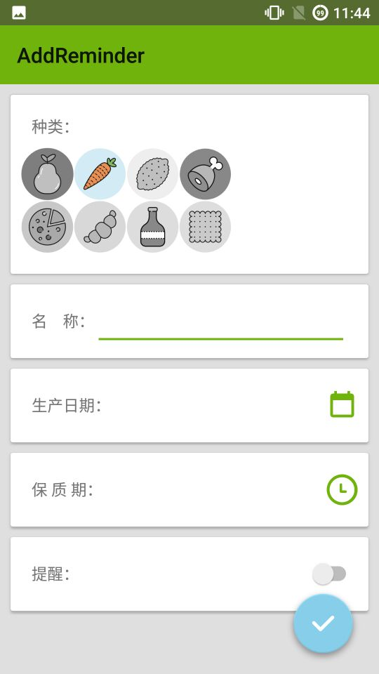

#Remind
***

2017/4/20

更新内容

* 修复了剩余时间显示问题（原来剩余时间一年会显示12月5天）
* 修复了生产日期可能选到未来日子的问题（其实就是规定了开始和结束的时间）
* 统一了生产日期，保质期的选择框风格

2017/4/18

功能：

* 1.添加提醒物品，输入生产日期，保质期
* 2.展示提醒物品的剩余天数，并且在到期的时候发通知自动提醒
* 3.批量管理提醒物品

改进：

* 1.图标不符合类别（之后会更新成其他图标，更加符合）
* 2.自定义提醒时间（现在是半夜12.提醒）
* 3.历史记录（现在过期的物品就不能再显示了）

截图

